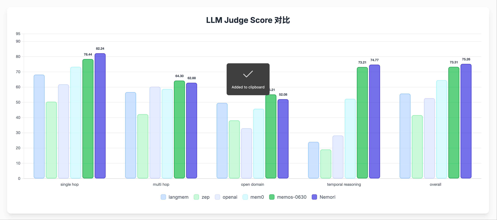
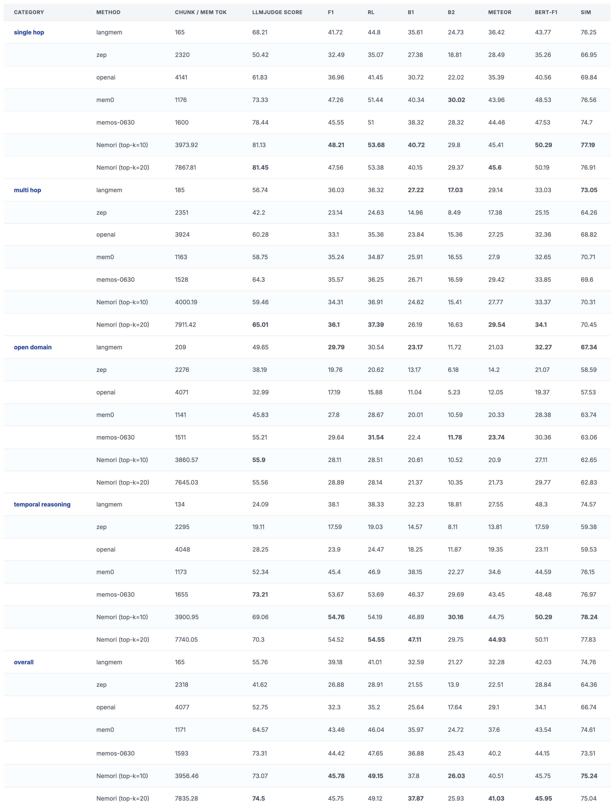

**Archived. Please visit [Nemori Repo](https://github.com/nemori-ai/nemori/) to view the latest version.**

Background: Nemori is a project derived from our team's episodic memory indexing module within the memory system of our Tanka.ai project—an MVP implementation that we plan to open-source. Nemori's core purpose is to share our approach to building memory indexing through Nature-Inspired Episodic Memory.

Given the recent surge of excellent open-source projects and research in memory systems, including this project, SuperMemory, and well-established projects like letta/mem0/zep, we've all converged on using the LoCoMo dataset as a benchmark. Consequently, we decided to participate in this benchmark with our MVP implementation that demonstrates our episodic memory indexing approach. (Special thanks to the MemOS team—we forked their project and extended the evaluation framework to support Nemori benchmarking.)

Here's a brief overview of our benchmark contributions:

1. Data Preprocessing

Since our production system processes raw episodic data incrementally, we reused our topic segmentation strategy. This embodies the core philosophy of episodic memory creation: "aligning with the granularity of human memory event episodes." While our approach may appear inefficient and simplistic, this reflects the simplifications made for our MVP. In production, we employ more cost-effective and efficient methods.

For episode generation, we chose the most straightforward version that best illustrates our approach, using only GPT-4o-mini for episodic memory extraction. Please refer to our prompts to understand how we guide the LLM in distilling episodic memories.

We established a minimal BM25 index for each user's episodic memories. This might raise questions, but again, it's a simplification. Our production system employs a hybrid retrieval strategy combining sparse (BM25) and dense (vector retrieval) methods to balance recall and semantic matching capabilities, with different reranking strategies tailored to specific business needs.

2. Retrieval

With the preprocessing complete, the subsequent process is relatively straightforward. We retrieve the top 20 results, have GPT-4o-mini generate responses, and follow an evaluation approach nearly identical to other projects.
The Nemori open-source release will be completed soon (I've already included [intermediate artifacts](https://github.com/nemori-ai/MemOS/tree/nemori-eval/evaluation/nemori_results) in the source code for those interested), allowing everyone to reproduce our complete results.

<a href="scores.png">
  
</a>

<a href="detail-scores.png">
  
</a>


-------------------------------

<div align="center">
  <a href="https://memos.openmem.net/">
    
  </a>


<h1 align="center">
   MemOS 1.0: 星河 (Stellar)  
</h1>

  <p>
    <a href="https://www.memtensor.com.cn/">
      
    </a>
    <a href="https://pypi.org/project/MemoryOS">
      
    </a>
    <a href="https://pypi.org/project/MemoryOS">
      
    </a>
    <a href="https://memos.openmem.net/docs/home">
      
    </a>
    <a href="https://arxiv.org/abs/2505.22101">
        
    </a>
    <a href="https://github.com/MemTensor/MemOS/discussions">
      
    </a>
    <a href="https://discord.gg/Txbx3gebZR">
      
    </a>
    <a href="docs/assets/memos-wechat-group.png">
      
    </a>
    <a href="https://opensource.org/license/apache-2-0/">
      
    </a>
  </p>
</div>

---

  <a href="https://memos.openmem.net/">
    
  </a>


**MemOS** is an operating system for Large Language Models (LLMs) that enhances them with long-term memory capabilities. It allows LLMs to store, retrieve, and manage information, enabling more context-aware, consistent, and personalized interactions.

- **Website**: <a href="https://memos.openmem.net/" target="_blank">https://memos.openmem.net/</a>
- **Documentation**: <a href="https://memos.openmem.net/docs/home" target="_blank">https://memos.openmem.net/docs/home</a>
- **API Reference**: <a href="https://memos.openmem.net/docs/api/info" target="_blank">https://memos.openmem.net/docs/api/info</a>
- **Source Code**: <a href="https://github.com/MemTensor/MemOS" target="_blank">https://github.com/MemTensor/MemOS</a>

## 📈 Performance Benchmark

MemOS demonstrates significant improvements over baseline memory solutions in multiple reasoning tasks.

| Model       | Avg. Score | Multi-Hop | Open Domain | Single-Hop | Temporal Reasoning |
|-------------|------------|-----------|-------------|------------|---------------------|
| **OpenAI**  | 0.5275     | 0.6028    | 0.3299      | 0.6183     | 0.2825              |
| **MemOS**   | **0.7331** | **0.6430** | **0.5521**   | **0.7844** | **0.7321**          |
| **Improvement** | **+38.98%** | **+6.67%** | **+67.35%** | **+26.86%** | **+159.15%**       |

> 💡 **Temporal reasoning accuracy improved by 159% compared to the OpenAI baseline.**


### Details of End-to-End Evaluation on LOCOMO

> [!NOTE]
> Comparison of LLM Judge Scores across five major tasks in the LOCOMO benchmark. Each bar shows the mean evaluation score judged by LLMs for a given method-task pair, with standard deviation as error bars. MemOS-0630 consistently outperforms baseline methods (LangMem, Zep, OpenAI, Mem0) across all task types, especially in multi-hop and temporal reasoning scenarios.

<a href="https://memos.openmem.net/">
  
</a>


## ✨ Key Features

- **🧠 Memory-Augmented Generation (MAG)**: Provides a unified API for memory operations, integrating with LLMs to enhance chat and reasoning with contextual memory retrieval.
- **📦 Modular Memory Architecture (MemCube)**: A flexible and modular architecture that allows for easy integration and management of different memory types.
- **💾 Multiple Memory Types**:
    - **Textual Memory**: For storing and retrieving unstructured or structured text knowledge.
    - **Activation Memory**: Caches key-value pairs (`KVCacheMemory`) to accelerate LLM inference and context reuse.
    - **Parametric Memory**: Stores model adaptation parameters (e.g., LoRA weights).
- **🔌 Extensible**: Easily extend and customize memory modules, data sources, and LLM integrations.

## 🚀 Getting Started

Here's a quick example of how to create a **`MemCube`**, load it from a directory, access its memories, and save it.

```python
from memos.mem_cube.general import GeneralMemCube

# Initialize a MemCube from a local directory
mem_cube = GeneralMemCube.init_from_dir("examples/data/mem_cube_2")

# Access and print all memories
print("--- Textual Memories ---")
for item in mem_cube.text_mem.get_all():
    print(item)

print("\n--- Activation Memories ---")
for item in mem_cube.act_mem.get_all():
    print(item)

# Save the MemCube to a new directory
mem_cube.dump("tmp/mem_cube")
```

What about **`MOS`** (Memory Operating System)? It's a higher-level orchestration layer that manages multiple MemCubes and provides a unified API for memory operations. Here's a quick example of how to use MOS:

```python
from memos.configs.mem_os import MOSConfig
from memos.mem_os.main import MOS


# init MOS
mos_config = MOSConfig.from_json_file("examples/data/config/simple_memos_config.json")
memory = MOS(mos_config)

# create user
user_id = "b41a34d5-5cae-4b46-8c49-d03794d206f5"
memory.create_user(user_id=user_id)

# register cube for user
memory.register_mem_cube("examples/data/mem_cube_2", user_id=user_id)

# add memory for user
memory.add(
    messages=[
        {"role": "user", "content": "I like playing football."},
        {"role": "assistant", "content": "I like playing football too."},
    ],
    user_id=user_id,
)

# Later, when you want to retrieve memory for user
retrieved_memories = memory.search(query="What do you like?", user_id=user_id)
# output text_memories: I like playing football, act_memories, para_memories
print(f"text_memories: {retrieved_memories['text_mem']}")
```

For more detailed examples, please check out the [`examples`](./examples) directory.

## 📦 Installation

> [!WARNING]
> Currently, MemOS primarily supports Linux platforms. You may encounter issues on Windows and macOS temporarily.

### Install via pip

```bash
pip install MemoryOS
```

### Development Install

To contribute to MemOS, clone the repository and install it in editable mode:

```bash
git clone https://github.com/MemTensor/MemOS.git
cd MemOS
make install
```

### Optional Dependencies

#### Ollama Support

To use MemOS with [Ollama](https://ollama.com/), first install the Ollama CLI:
```bash
curl -fsSL https://ollama.com/install.sh | sh
```

#### Transformers Support

To use functionalities based on the `transformers` library, ensure you have [PyTorch](https://pytorch.org/get-started/locally/) installed (CUDA version recommended for GPU acceleration).

## 💬 Community & Support

Join our community to ask questions, share your projects, and connect with other developers.

- **GitHub Issues**: Report bugs or request features in our <a href="https://github.com/MemTensor/MemOS/issues" target="_blank">GitHub Issues</a>.
- **GitHub Pull Requests**: Contribute code improvements via <a href="https://github.com/MemTensor/MemOS/pulls" target="_blank">Pull Requests</a>.
- **GitHub Discussions**: Participate in our <a href="https://github.com/MemTensor/MemOS/discussions" target="_blank">GitHub Discussions</a> to ask questions or share ideas.
- **Discord**: Join our <a href="https://discord.gg/Txbx3gebZR" target="_blank">Discord Server</a>.
- **WeChat**: Scan the QR code to join our WeChat group.


## 📜 Citation

If you use MemOS in your research, please cite our paper:

```bibtex
@article{li2025memos,
  title={MemOS: An Operating System for Memory-Augmented Generation (MAG) in Large Language Models},
  author={Li, Zhiyu and Song, Shichao and Wang, Hanyu and Niu, Simin and Chen, Ding and Yang, Jiawei and Xi, Chenyang and Lai, Huayi and Zhao, Jihao and Wang, Yezhaohui and others},
  journal={arXiv preprint arXiv:2505.22101},
  year={2025}
}
```

## 🙌 Contributing

We welcome contributions from the community! Please read our [contribution guidelines](./docs/contribution/overview.md) to get started.

## 📄 License

MemOS is licensed under the [Apache 2.0 License](./LICENSE).

## 📰 News

Stay up to date with the latest MemOS announcements, releases, and community highlights.

- **2025-07-07** – 🎉 *MemOS 1.0 (Stellar) Preview Release*: A SOTA Memory OS for LLMs is now open-sourced.
- **2025-05-28** – 🎉 *Short Paper Uploaded*: [MemOS: An Operating System for Memory-Augmented Generation (MAG) in Large Language Models](https://arxiv.org/abs/2505.22101) was published on arXiv.
- **2024-07-04** – 🎉 *Memory3 Model Released at WAIC 2024*: The new memory-layered architecture model was unveiled at the 2024 World Artificial Intelligence Conference.
- **2024-07-01** – 🎉 *Memory3 Paper Released*: [Memory3: Language Modeling with Explicit Memory](https://arxiv.org/abs/2407.01178) introduces the new approach to structured memory in LLMs.
